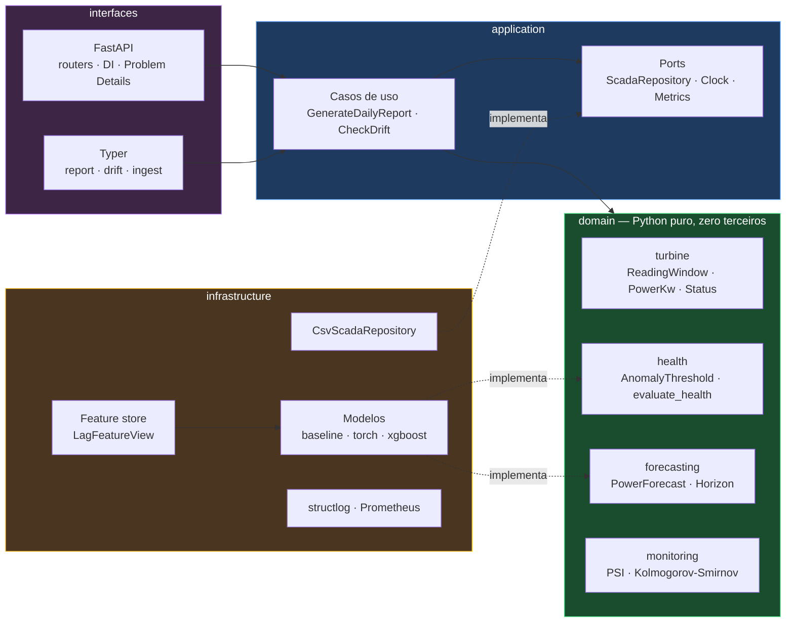

# Eólica SCADA

Monitoramento preditivo de turbinas eólicas a partir de telemetria SCADA:
detecção de anomalia por reconstrução, previsão de geração e detecção de drift —
servidos por uma API HTTP e uma CLI, com arquitetura em camadas verificada por
teste.

[](https://github.com/BayesTheory/Eolica-Scada-Test/actions/workflows/ci.yml)


---

## O problema

Uma turbina eólica gera telemetria continuamente — vento, potência, rotação,
temperatura do gerador, ângulo de pitch. Duas perguntas importam ao operador:

1. **Esta máquina está se comportando como quando estava saudável?**
   Um autoencoder aprende a "assinatura" da operação normal; quando o erro de
   reconstrução sobe de forma sustentada, algo mudou.
2. **Quanta energia ela vai gerar no próximo intervalo?**
   Necessário para planejar despacho e janela de manutenção.

E uma terceira, que só aparece depois que o sistema está em produção:

3. **O modelo ainda descreve o mundo que está vendo?**
   Um modelo treinado em 2022 continua respondendo com toda a confiança em 2024.
   Sem medir drift, ninguém descobre que a distribuição mudou embaixo dele.

## Arquitetura

Domain-Driven Design com dependências apontando sempre para dentro.



A regra é **verificada por teste**, não prometida no README:
[`tests/architecture/test_layer_dependencies.py`](tests/architecture/test_layer_dependencies.py)
lê a AST de cada módulo e falha o CI se uma seta apontar para o lado errado.

> `domain/` não importa pandas, numpy, torch nem pydantic. Só a biblioteca
> padrão. É o que mantém a suíte de regras de negócio em **0,6 segundo** e o que
> permite trocar torch por ONNX sem tocar numa linha de lógica.

## Começando

```bash
git clone https://github.com/BayesTheory/Eolica-Scada-Test.git
cd Eolica-Scada-Test

make setup                      # venv + dependências
make test                       # 165 testes, ~3s
make report DAY=2022-01-20      # relatório no terminal
make serve                      # API em http://localhost:8000/docs
```

Funciona logo após o clone: o repositório versiona um recorte real de duas
semanas de telemetria (`data/samples/`), e a aplicação sobe com ele quando o
dataset completo não está presente — registrando um `WARNING` explícito.

Para o dataset inteiro:

```bash
# baixe de https://zenodo.org/records/15700928 para data/raw/
eolica ingest
```

Com Docker:

```bash
docker compose up -d            # API + MLflow + Prometheus
curl localhost:8000/api/v1/reports/2022-01-20 | jq
```

## O que ele responde

```console
$ eolica report 2022-01-20

2022-01-20  —  EM_MANUTENCAO
  Anomalia sustentada por 21 janela(s) hoje e 11 no período anterior:
  indica intervenção em curso.

  janelas avaliadas ....... 35
  acima do limiar ......... 21
  anomalias sustentadas ... 21
  limiar .................. 8.188941
  véspera ................. 11 anomalia(s)

  cobertura ............... 43.8% (63/144 leituras, 2 segmento(s))
  previsão ................ 0.000 kW @ 2022-01-20 23:00 [moving-average-6@1]
```

Repare em **cobertura 43,8% e 2 segmentos**: aquele dia tem um buraco de horas
no meio. O relatório diz isso em vez de fingir que analisou um dia inteiro.

### API

| Método | Rota | O que faz |
|---|---|---|
| `GET` | `/api/v1/reports/{date}` | Relatório diário: saúde, cobertura, previsão |
| `GET` | `/api/v1/drift` | PSI por feature, referência × período recente |
| `GET` | `/health/live` | Liveness — não toca modelo nem disco |
| `GET` | `/health/ready` | Readiness — só 200 depois de calibrar o detector |
| `GET` | `/metrics` | Exposição Prometheus |
| `GET` | `/docs` | OpenAPI com schemas e exemplos |

Erros seguem [RFC 9457](https://www.rfc-editor.org/rfc/rfc9457):

```json
{
  "type": ".../docs/errors.md#not-found",
  "title": "Recurso não encontrado",
  "status": 404,
  "detail": "Telemetria não encontrado para '2030-06-15'",
  "instance": "/api/v1/reports/2030-06-15",
  "code": "not-found",
  "resource": "Telemetria",
  "identifier": "2030-06-15"
}
```

## Decisões de engenharia

| Decisão | Por quê |
|---|---|
| **Domínio sem dependências de terceiros** | Regra de negócio legível por quem entende de turbina, não de tensores. Suíte de domínio em 0,6s. |
| **Feature store com assinatura versionada** | Uma única implementação de lag. Um teste prova que treino e serving produzem o mesmo vetor, bit a bit. |
| **`ReadingWindow` recusa janela furada** | A série tem 30 descontinuidades. Uma janela que atravessa um buraco produz erro de reconstrução alto — indistinguível de falha real. |
| **Limiar calibrado no `lifespan`** | Calcular na primeira requisição faz o usuário pagar a varredura de 32 mil registros como latência, e cria estado mutável compartilhado. |
| **Janela de persistência implementada — e medida** | Estava no config da v1 e nunca era lida. Implementada, ela é configurável e auditável. Se ela *ajuda* é outra pergunta: [ver o backtest abaixo](#o-que-a-medição-mostrou). |
| **Baseline explícito (z-score, persistência)** | Sem régua, "MSE 0.003" não significa nada. E permite a API subir e ser testada sem GPU. |
| **Gate de promoção contra baseline** | Modelo só é registrado se superar o baseline por margem mínima. A v1 chamava `register_model()` incondicionalmente após todo treino. |
| **`torch`/`mlflow` em extra opcional** | O CI roda a suíte inteira em segundos. Quem quer treinar instala `[ml]`. |
| **Erros tipados por camada** | Dia inexistente é 404, dia fragmentado é 422, registry fora é 503. Nenhum é 500. |
| **Segredos só por `SecretStr`** | Sem default, sem `repr`, sem chegar perto do fonte. |

## O que a medição mostrou

O backtest (`eolica backtest`) varre o histórico inteiro — 65.738 leituras, 72
segmentos contíguos, 61.239 janelas avaliadas — comparando valores de janela de
persistência contra os períodos de falha reportados pelo próprio SCADA:

| janela | episódios | precisão | recall | taxa de alarme falso |
|---:|---:|---:|---:|---:|
| 1 | 262 | 42,4% | 88,7% | 34,27% |
| 3 | 256 | 42,4% | 88,7% | 34,25% |
| 6 | 250 | 42,4% | 88,6% | 34,22% |
| 12 | 238 | 42,3% | 88,2% | 34,11% |

**A janela de persistência praticamente não muda nada aqui.** Passar de 1 para 6
evita 25 janelas de alarme falso — em cerca de 16 mil — e custa 5 detecções.

Esse é o resultado oposto ao que a intuição sugeria, e ele é a informação mais
útil deste repositório. O que ele diz é que o problema não está no *debouncing*:
está no detector. Uma taxa de alarme falso de 34% com precisão de 42% significa
que o baseline z-score não separa bem operação normal de falha nesta série — e
nenhum ajuste de persistência conserta isso.

Duas ressalvas honestas sobre o número:

- A referência é o código de status 13 do SCADA, que aparece **durante** a
  falha, não antes. Um detector por reconstrução deveria alertar cedo, e a
  recall medida assim subestima exatamente essa capacidade.
- Uma janela de 60 passos conta como "evento" se qualquer uma das 10 horas
  cobertas teve falha, o que infla os positivos da referência.

O próximo passo é o LSTM autoencoder (`eolica.infrastructure.ml.training`)
enfrentar esse mesmo backtest. Se ele não melhorar precisão e taxa de alarme
falso de forma expressiva, o gate de promoção recusa registrá-lo — que é o
comportamento correto.

## Testes

```console
$ make test
375 passed in 11.90s
```

| Suíte | O que cobre | Tempo |
|---|---|---|
| `tests/unit/domain` | Regras de negócio puras | ~1s |
| `tests/unit/featurestore` | Ausência de skew **e** de vazamento temporal | ~1s |
| `tests/unit/application` | Casos de uso com fakes em memória | ~0,5s |
| `tests/unit/ml` | Adaptadores torch e resolução no registry | ~5s |
| `tests/contract` | Contrato de dado contra telemetria **real** | ~1s |
| `tests/integration` | API completa via `TestClient` | ~3s |
| `tests/architecture` | Setas de dependência + ausência de segredos | ~1s |

Três testes carregam mais peso que os outros:

- **`test_treino_e_serving_produzem_o_mesmo_vetor`** — compara, bit a bit, o
  vetor de features das duas rotas para o mesmo instante alvo. Reintroduzir uma
  segunda implementação de lag quebra o build.
- **`test_alterar_o_futuro_nao_muda_nenhuma_feature_do_passado`** — reescreve
  todo o futuro da série e exige que a matriz do passado não mude. É o que
  impede `rolling().std()` de vazar o instante que se quer prever.
- **`test_assinatura_divergente_recusa_servir`** — mudar `n_lags` sem retreinar
  passa a derrubar o readiness probe em vez de degradar a previsão em silêncio.

Os testes de contrato rodam sobre dado de verdade, escolhido justamente por
conter o que dado sintético bem-comportado não tem: gaps, potência negativa e
códigos de status indocumentados.

## De onde isto veio

A v1 deste repositório era um pipeline funcional — LSTM Autoencoder, XGBoost,
MLflow, FastAPI, co-piloto com Gemini — construído como scripts na raiz. Este
reescrita nasceu de uma auditoria dele. Alguns achados, porque explicam
decisões que de outra forma pareceriam excesso de zelo:

- **`python main.py process_data` não rodava.** Chamava `pipeline_data.main()`,
  função que não existia no módulo. O comando estava documentado no README.
- **Data inexistente virava HTTP 500.** `df.loc["2022-02-08"]` levanta
  `KeyError`; a checagem `if df_dia.empty` logo abaixo nunca era alcançada.
- **O prompt do LLM instruía o modelo a narrar esse 500 ao operador** como
  "os dados para esse dia estão corrompidos". Não estavam — o dia não existia.
- **Duas regras de negócio moravam no prompt do LLM**: o critério de "em
  manutenção" e a proibição de exibir potência negativa. Valiam só no chat, e
  eram invisíveis para qualquer outro consumidor da API.
- **`persistence_window: 6` estava no `config.yaml` e nenhuma linha o lia.**
- **Features de lag eram construídas em dois lugares diferentes**, com `n_lags`
  vindo de caminhos distintos da config. Coincidiam em 6 por acidente — ambas
  caíam no mesmo default porque a chave não existia no arquivo.
- **`GeneratorSpeed` era usada como feature** apesar de o metadado do fabricante
  marcá-la como `Reliable Measurement = FALSE`.
- **1.378 arquivos de tracking do MLflow versionados** no git, sem `.gitignore`.
- **Uma chave de API do Google em texto claro**, commitada num repositório
  público. Foi revogada; o CI agora roda `gitleaks` no histórico.

Cada um desses aparece como comentário no ponto do código que o corrige, e a
maioria virou um teste com nome próprio. A v1 continua no histórico do git.

## Estrutura

```
src/eolica/
├── domain/              # regras de negócio — só stdlib
│   ├── turbine/         # ReadingWindow, PowerKw, OperatingStatus
│   ├── health/          # threshold, persistência, veredito + port
│   ├── forecasting/     # previsão, horizonte + port
│   └── monitoring/      # PSI, Kolmogorov-Smirnov
├── application/         # casos de uso + ports de infra
├── infrastructure/      # adaptadores: CSV, feature store, modelos, observabilidade
└── interfaces/          # FastAPI + CLI (composition root)

tests/
├── unit/ contract/ integration/ architecture/
docker/                  # Dockerfile multi-stage, Prometheus
docs/adr/                # decisões de arquitetura registradas
scripts/                 # geração do sample versionado
```

## Dataset

[Aventa AV-7 — IET-OST Research Wind Turbine](https://zenodo.org/records/15700928)
(Zenodo). Turbina de 6.2 kW, rotor de 12,9 m, hub a 18 m. Telemetria a 1 Hz
reamostrada para médias de 10 minutos, de dezembro/2021 a julho/2023.

Canais nomeados segundo **IEC 61400-25** — o mapeamento de nomes internos para o
padrão está em [`data/metadata/scada_channels.csv`](data/metadata/scada_channels.csv)
e é honrado pelo contrato de dado.

## Licença

MIT.
