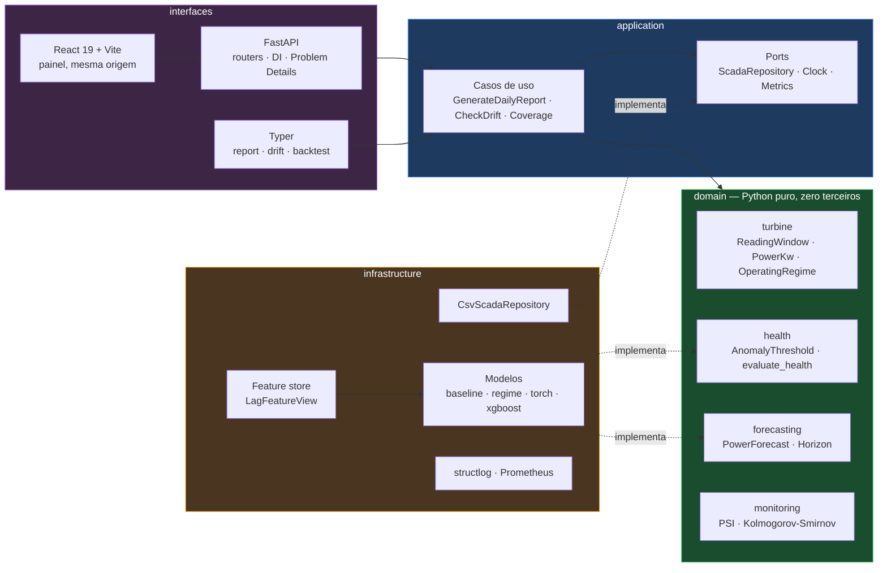

# Eólica SCADA

Monitoramento preditivo de turbinas eólicas a partir de telemetria SCADA:
detecção de anomalia por reconstrução, previsão de geração e detecção de drift —
servidos por uma API HTTP, um painel web e uma CLI, com arquitetura em camadas
verificada por teste.

[](https://github.com/BayesTheory/Eolica-Scada-Test/actions/workflows/ci.yml)
[](https://github.com/BayesTheory/Eolica-Scada-Test/actions/workflows/deploy.yml)


---

## O problema

Uma turbina eólica gera telemetria continuamente — vento, potência, rotação,
temperatura do gerador, ângulo de pitch. Duas perguntas importam ao operador:

1. **Esta máquina está se comportando como quando estava saudável?**
   Um autoencoder aprende a "assinatura" da operação normal; quando o erro de
   reconstrução sobe de forma sustentada, algo mudou.
2. **Quanta energia ela vai gerar no próximo intervalo?**
   Necessário para planejar despacho e janela de manutenção.

E uma terceira, que só aparece depois que o sistema está em produção:

3. **O modelo ainda descreve o mundo que está vendo?**
   Um modelo treinado em 2022 continua respondendo com toda a confiança em 2024.
   Sem medir drift, ninguém descobre que a distribuição mudou embaixo dele.

## Arquitetura

Domain-Driven Design com dependências apontando sempre para dentro.



A regra é **verificada por teste**, não prometida no README:
[`tests/architecture/test_layer_dependencies.py`](tests/architecture/test_layer_dependencies.py)
lê a AST de cada módulo e falha o CI se uma seta apontar para o lado errado.

> `domain/` não importa pandas, numpy, torch nem pydantic. Só a biblioteca
> padrão. É o que mantém a suíte de regras de negócio em **0,4 segundo** e o que
> permite trocar torch por ONNX sem tocar numa linha de lógica.

## Começando

```bash
git clone https://github.com/BayesTheory/Eolica-Scada-Test.git
cd Eolica-Scada-Test

make setup                      # venv + dependências
make test                       # 419 testes, ~3s (431 com make setup-ml)
make report DAY=2022-01-15      # relatório no terminal
make serve                      # API em http://localhost:8000/docs
```

Funciona logo após o clone: o repositório versiona um recorte real de duas
semanas de telemetria (`data/samples/`), e a aplicação sobe com ele quando o
dataset completo não está presente — registrando um `WARNING` explícito.

O sample cobre **2022-01-14 a 2022-01-27**; qualquer data fora disso responde
404 até você ingerir o dataset inteiro:

```bash
# baixe de https://zenodo.org/records/15700928 para data/raw/
eolica ingest
```

Com Docker:

```bash
docker compose up -d            # API + MLflow + Prometheus + Grafana
curl localhost:8000/api/v1/reports/2022-01-15 | jq
```

### Painel

O frontend é um app React 19 servido pela **própria API, na mesma origem** — um
único deployable, sem CORS e sem a possibilidade de as duas pontas ficarem em
versões diferentes.

```bash
cd frontend
npm ci
npm run dev                     # http://localhost:5173, API em :8000
npm run build                   # gera frontend/dist/, que a API monta na raiz
```

Se `frontend/dist/` não existir, a API sobe assim mesmo e registra a ausência em
log — ela é útil sozinha, e o container de treino não precisa de interface.

### CLI

| Comando | O que faz |
|---|---|
| `eolica report <data>` | Relatório diário de saúde e previsão no terminal |
| `eolica drift` | PSI por feature, referência × período recente |
| `eolica backtest` | Mede quanto a janela de persistência vale sobre o histórico |
| `eolica calibrate` | Calibra o detector e mostra o limiar, sem subir a API |
| `eolica ingest` | Reamostra o SCADA bruto para a grade de 10 min e valida o contrato |
| `eolica serve` | Sobe a API HTTP |

## O que ele responde

```console
$ eolica report 2022-01-15

2022-01-15  —  ALERTA
  Anomalia sustentada por 85 janela(s) consecutivas (mínimo 6), sem ocorrência
  no período anterior.

  janelas avaliadas ....... 85
  acima do limiar ......... 85
  anomalias sustentadas ... 85
  limiar .................. 81.291368
  véspera ................. 0 anomalia(s)

  cobertura ............... 100.0% (144/144 leituras, 1 segmento(s))
  previsão ................ 0.000 kW @ 2022-01-16 00:00 [moving-average-6@1]
```

O limiar depende do acervo sobre o qual o detector calibrou: os números acima
são do dataset completo. Rodando só com o sample versionado o comando funciona
igual, mas calibra sobre duas semanas e produz outro limiar — o relatório é
reprodutível, o número absoluto não é comparável entre acervos.

**Cobertura não é enfeite.** `2022-01-20` tem 43,8% de cobertura em 2 segmentos
— um buraco de horas no meio do dia. Nenhum trecho contíguo chega às 60 leituras
que a janela do modelo exige, e o sistema **recusa responder** em vez de fingir
que analisou um dia inteiro:

```console
$ eolica report 2022-01-20
erro: São necessárias no mínimo 60 leituras contíguas, mas só há 0
      (available=0, required=60, subject='leituras contíguas')
```

Pela API isso é um 422 tipado, não um 500 — ver abaixo. Para inspecionar um dia
assim, `EOLICA_HEALTH_WINDOW_SIZE` aceita uma janela menor, e `/api/v1/coverage`
mostra a fragmentação de todo o acervo de uma vez.

### API

| Método | Rota | O que faz |
|---|---|---|
| `GET` | `/api/v1/reports/{date}` | Relatório diário: saúde, cobertura, previsão |
| `GET` | `/api/v1/coverage` | Cobertura dia a dia: completude, segmentos, dias ausentes |
| `GET` | `/api/v1/drift` | PSI por feature, referência × período recente |
| `GET` | `/health/live` | Liveness — não toca modelo nem disco |
| `GET` | `/health/ready` | Readiness — só 200 depois de calibrar o detector |
| `GET` | `/metrics` | Exposição Prometheus |
| `GET` | `/docs` | OpenAPI com schemas e exemplos |
| `GET` | `/` | Painel React (se `frontend/dist/` existir) |

O schema fica versionado em [`frontend/openapi.json`](frontend/openapi.json) e o
CI falha se ele divergir do código, ou se os tipos TypeScript gerados a partir
dele divergirem do que está commitado. Mudar um contrato sem regenerar quebra o
build, e não a tela do operador.

Erros seguem [RFC 9457](https://www.rfc-editor.org/rfc/rfc9457):

```json
{
  "type": ".../docs/errors.md#not-found",
  "title": "Recurso não encontrado",
  "status": 404,
  "detail": "Telemetria não encontrado para '2030-06-15'",
  "instance": "/api/v1/reports/2030-06-15",
  "code": "not-found",
  "resource": "Telemetria",
  "identifier": "2030-06-15"
}
```

```json
{
  "type": ".../docs/errors.md#insufficient-data",
  "title": "Dados insuficientes para a análise",
  "status": 422,
  "detail": "São necessárias no mínimo 60 leituras contíguas, mas só há 0",
  "instance": "/api/v1/reports/2022-01-20",
  "code": "insufficient-data",
  "required": 60,
  "available": 0
}
```

O catálogo completo está em [`docs/errors.md`](docs/errors.md) — é o destino do
campo `type`, e o painel ramifica a mensagem ao operador pelo `code`: dia
ausente do acervo não é "falha do sistema".

## Decisões de engenharia

| Decisão | Por quê |
|---|---|
| **Domínio sem dependências de terceiros** | Regra de negócio legível por quem entende de turbina, não de tensores. Suíte de domínio em 0,4s. |
| **Feature store com assinatura versionada** | Uma única implementação de lag. Um teste prova que treino e serving produzem o mesmo vetor, bit a bit. |
| **`ReadingWindow` recusa janela furada** | A série tem 30 descontinuidades. Uma janela que atravessa um buraco produz erro de reconstrução alto — indistinguível de falha real. |
| **Limiar calibrado no `lifespan`** | Calcular na primeira requisição faz o usuário pagar a varredura de 32 mil registros como latência, e cria estado mutável compartilhado. |
| **Janela de persistência implementada — e medida** | Estava no config da v1 e nunca era lida. Implementada, ela é configurável e auditável. Se ela *ajuda* é outra pergunta: [ver o backtest abaixo](#o-que-a-medição-mostrou--e-o-que-ela-consertou). |
| **Baseline explícito (z-score, persistência)** | Sem régua, "MSE 0.003" não significa nada. E permite a API subir e ser testada sem GPU. |
| **Gate de promoção contra baseline** | Modelo só é registrado se superar o baseline por margem mínima. A v1 chamava `register_model()` incondicionalmente após todo treino. |
| **`torch`/`mlflow` em extra opcional** | O CI roda a suíte inteira em segundos. Quem quer treinar instala `[ml]`. |
| **Erros tipados por camada** | Dia inexistente é 404, dia fragmentado é 422, registry fora é 503. Nenhum é 500. |
| **Frontend na mesma origem da API** | Um deployable, zero CORS, impossível ficarem em versões diferentes. O contrato entre eles é gerado do OpenAPI e verificado no CI. |
| **Segredos só por `SecretStr`** | Sem default, sem `repr`, sem chegar perto do fonte. |

## O que a medição mostrou — e o que ela consertou

Esta seção é o miolo do projeto: uma medição derrubou uma hipótese, a hipótese
derrubada apontou a causa real, e a correção mudou o sistema de inútil para
utilizável. Reproduza tudo com `eolica backtest` e
`python scripts/compare_detectors.py`.

### Metodologia, antes do número

Um número de alarme falso sem base rate não quer dizer nada — é a primeira coisa
que se cutuca numa banca, e com razão. Então o escopo primeiro:

| | |
|---|---|
| Acervo | 65.738 leituras de 10 min — **487 dias com telemetria** num span de 567 dias |
| Referência de calibração | 32.252 leituras em operação normal, em 131 segmentos contíguos |
| Janelas avaliadas | **61.239** sub-janelas de 60 passos (10 h) |
| Rótulo | código de status 13 do SCADA — janela é positiva se qualquer leitura dela tem falha |
| **Base rate** | **22,12%** — 13.544 janelas positivas contra 47.695 saudáveis |
| Limiar | percentil 99,5 dos erros de reconstrução da própria referência |
| Janela de persistência | 6 (o default em produção); a tabela também traz 1 |

A base rate de 22% é o que dá sentido às taxas: um detector que dissesse "sempre
anomalia" teria 22,1% de precisão e 100% de recall, e um que dissesse "nunca"
teria 77,9% de acurácia. São essas as réguas.

### O detector, antes e depois

Com a janela de persistência em 6, sobre as 61.239 janelas:

| | z-score **global** | z-score **por regime** |
|---|---:|---:|
| Verdadeiros positivos | 12.003 | 7.774 |
| **Falsos positivos** | **16.319** | **90** |
| Falsos negativos | 1.541 | 5.770 |
| Verdadeiros negativos | 31.376 | 47.605 |
| Precisão | 42,4% | **98,9%** |
| Recall | 88,6% | 57,4% |
| **Taxa de alarme falso** | **34,22%** | **0,19%** |
| F1 | 57,3% | 72,6% |
| Episódios de alarme em 487 dias | 250 | 30 |

Com janela 1, os mesmos detectores dão 34,27% × 0,20% de alarme falso (16.344
contra 95 falsos positivos) e 262 × 35 episódios — que são os números citados no
resto desta seção.

**"0,20%" é 95 falsos positivos em 47.695 janelas saudáveis**, e é assim que ele
deve ser lido. A queda é de **172×** em taxa de alarme falso, ou de 16.344 para
95 em contagem absoluta. Um alarme a cada dois dias virou um a cada duas
semanas.

**O custo é real:** recall caiu de 88,7% para 57,4% — o detector novo perde
cerca de metade dos eventos que o antigo pegava. A troca é deliberada. Um
detector que dispara em um terço dos períodos saudáveis é desligado pelo
operador na primeira semana, e a partir daí seu recall efetivo é zero. 99% de
precisão com 57% de recall é um ponto de operação em que alguém confia; o
anterior não era.

### Como se chegou lá

**1. A hipótese inicial estava errada.** O `config.yaml` da v1 declarava
`persistence_window: 6` sem nunca lê-lo, e o README desta reescrita afirmava que
o parâmetro filtrava ruído de sensor. O backtest mostrou que não filtra nada:

| janela | episódios | precisão | recall | alarme falso |
|---:|---:|---:|---:|---:|
| 1 | 262 | 42,4% | 88,7% | 34,27% |
| 6 | 250 | 42,4% | 88,6% | 34,22% |
| 12 | 238 | 42,3% | 88,2% | 34,11% |

**2. O resultado nulo apontou a causa.** Se aumentar a janela não ajuda, o erro
não é feito de picos isolados — é ruído *sustentado*. Ruído sustentado tem uma
explicação natural: o detector comparava cada janela contra a distribuição de
**toda** a operação normal. Mas operar a 2 m/s e a 11 m/s são estados
legitimamente diferentes da mesma máquina saudável. O erro estava medindo
**vento**, não saúde — e como o vento varia o dia inteiro, ficava alto em blocos.

**3. A correção.** [`OperatingRegime`](src/eolica/domain/turbine/regimes.py)
particiona a operação pelo envelope declarado pelo fabricante (cut-in 2,0 m/s,
cut-out 12,0 m/s), e o
[detector](src/eolica/infrastructure/ml/regime_detector.py) calibra uma
referência por regime. As fronteiras vêm da folha de dados e não de quantis
dos dados: assim o regime significa a mesma coisa antes e depois de um retreino.

### A fronteira que a folha de dados não declara

Cut-in e cut-out vêm do metadado do fabricante. A fronteira entre carga parcial
e plena precisa da **velocidade nominal**, e a folha da Aventa AV-7 não a
declara — então
[`RATED_WIND_FRACTION = 0.55`](src/eolica/domain/turbine/regimes.py) a aproxima
como fração da faixa útil, o que dá 7,5 m/s.

Um parâmetro escolhido assim é exatamente onde um resultado bom pode ser
acidente. Medindo (janela de persistência 6, tudo o mais igual):

| fração | vento nominal | precisão | recall | **alarme falso** | F1 | falsos positivos |
|---:|---:|---:|---:|---:|---:|---:|
| 0,35 | 5,5 m/s | 51,6% | 96,0% | 25,617% | 67,1% | 12.218 |
| 0,40 | 6,0 m/s | 98,6% | 64,4% | 0,262% | 77,9% | 125 |
| 0,45 | 6,5 m/s | 99,2% | 57,3% | **0,136%** | 72,6% | 65 |
| 0,50 | 7,0 m/s | 86,6% | 73,8% | 3,239% | **79,7%** | 1.545 |
| **0,55** | **7,5 m/s** | **98,9%** | **57,4%** | **0,189%** | **72,6%** | **90** |
| 0,60 | 8,0 m/s | 31,7% | 85,0% | 51,951% | 46,2% | 24.778 |
| 0,65 | 8,5 m/s | 32,5% | 97,6% | 57,478% | 48,8% | 27.414 |
| 0,75 | 9,5 m/s | 32,2% | 97,6% | 58,365% | 48,4% | 27.837 |

**O resultado não é robusto a esse parâmetro, e a curva nem é monótona.** Entre
0,40 e 0,55 o detector fica na faixa de 0,1–0,3% de alarme falso; em 0,50 piora
uma ordem de grandeza sem motivo aparente; a partir de 0,60 desaba para 52% —
**pior que o z-score global** que ele veio substituir.

O mecanismo é rastreável e não é misterioso. Só **5,4%** das leituras de
referência estão acima de 7,5 m/s, então mover a fronteira esvazia rápido o
regime de plena carga — 1.524 leituras em 0,45, 832 em 0,55, 486 em 0,60, 250 em
0,75. Como o limiar é o percentil 99,5 sobre os erros da referência inteira, um
regime magro encolhe a cauda e derruba o limiar junto: **109,2 → 81,3 → 9,0 →
7,1**. Com o limiar em 9, quase tudo vira alarme.

Isso não invalida condicionar ao regime — invalida tratar `0.55` como se fosse
dado do fabricante. E dá para fazer melhor que "escolhi um número": a nominal
sai da própria física, com `P = ½·ρ·A·Cp·η·v³` sobre os 130,7 m² de rotor e os
6,2 kW nominais do metadado:

| `Cp·η` | vento nominal | fração equivalente |
|---:|---:|---:|
| 0,40 | 5,8 m/s | 0,38 |
| 0,35 | 6,1 m/s | 0,41 |
| 0,30 | 6,4 m/s | 0,44 |
| 0,25 | 6,8 m/s | 0,48 |

Para um rendimento plausível de turbina pequena, a nominal cai em **5,8–6,8 m/s
— fração 0,38 a 0,48**. O valor em produção (0,55) está *acima* dessa faixa;
0,45 é o que a física sustenta, e é também onde o alarme falso é menor (0,136%).
Trocar a constante é mudança de código com efeito no comportamento do detector,
então fica registrada aqui como pendência e não vai junto desta atualização de
documentação.

### Ressalvas honestas sobre o número

- A referência é o código de status 13 do SCADA, que aparece **durante** a falha,
  não antes. Um detector por reconstrução deveria alertar cedo, e a recall
  medida assim subestima exatamente essa capacidade.
- Uma janela de 60 passos conta como "evento" se qualquer uma das 10 horas
  cobertas teve falha, o que infla os positivos da referência.
- O LSTM autoencoder ainda não enfrentou este backtest. O gate de promoção
  recusa registrá-lo se não superar o baseline por margem — e agora o baseline
  é bem mais difícil de bater.
- **Limiar e referência saem do mesmo acervo.** Não há separação treino/teste
  temporal: o percentil 99,5 é calculado sobre a operação normal de todo o
  período, e depois avaliado sobre esse mesmo período. Isso favorece o detector,
  e o número honesto para produção sairia de uma referência anterior ao período
  avaliado.
- **A fronteira de carga plena não vem da folha de dados** e o resultado é
  sensível a ela — [ver a tabela acima](#a-fronteira-que-a-folha-de-dados-não-declara).

Tudo nesta seção sai de `eolica backtest` e
[`scripts/compare_detectors.py`](scripts/compare_detectors.py), sobre o dataset
completo do Zenodo. A matriz de confusão e a varredura da fronteira não são
impressas por esses comandos — são derivadas dos mesmos objetos de domínio
(`DetectionMetrics`, em [`domain/evaluation`](src/eolica/domain/evaluation/value_objects.py)),
que já carregam as quatro contagens.

## Testes

```console
$ make test            # com o extra [ml]; sem ele, 419 passed, 1 skipped
431 passed in 6.06s
```

| Suíte | O que cobre | Testes | Tempo |
|---|---|---:|---:|
| `tests/unit/domain` | Regras de negócio puras | 136 | 0,4s |
| `tests/unit/featurestore` | Ausência de skew **e** de vazamento temporal | 37 | 0,4s |
| `tests/unit/application` | Casos de uso com fakes em memória | 17 | 0,3s |
| `tests/unit/ml` | Adaptadores torch e resolução no registry | 40 | 2,9s |
| `tests/contract` | Contrato de dado contra telemetria **real** | 35 | 1,0s |
| `tests/integration` | API completa via `TestClient` | 17 | 1,4s |
| `tests/architecture` | Setas de dependência + ausência de segredos | 149 | 0,8s |
| `frontend` (vitest) | Cliente de API e componentes do painel | 19 | 5,4s |

Dois esclarecimentos sobre esse "431", porque as contas não fecham sozinhas:

- **Contar `def test_` no fonte dá 277.** A diferença são os casos gerados por
  `@pytest.mark.parametrize` — 431 é o que o `pytest` coleta e executa.
- **O CI executa 419, não 431.** Sem o extra `[ml]`, o módulo do adaptador torch
  é pulado inteiro (`419 passed, 1 skipped`), e o CI roda de propósito sem
  `torch` para manter a suíte em segundos. O número cheio sai de um ambiente com
  `make setup-ml`. Nada é pulado em silêncio nos dois casos: `pytest -rs` nomeia
  o módulo e o motivo.

Três testes carregam mais peso que os outros:

- **`test_treino_e_serving_produzem_o_mesmo_vetor`** — compara, bit a bit, o
  vetor de features das duas rotas para o mesmo instante alvo. Reintroduzir uma
  segunda implementação de lag quebra o build.
- **`test_alterar_o_futuro_nao_muda_nenhuma_feature_do_passado`** — reescreve
  todo o futuro da série e exige que a matriz do passado não mude. É o que
  impede `rolling().std()` de vazar o instante que se quer prever.
- **`test_assinatura_divergente_recusa_servir`** — mudar `n_lags` sem retreinar
  passa a derrubar o readiness probe em vez de degradar a previsão em silêncio.

Os testes de contrato rodam sobre dado de verdade, escolhido justamente por
conter o que dado sintético bem-comportado não tem: gaps, potência negativa e
códigos de status indocumentados.

### O que o CI verifica

Sete jobs em [`ci.yml`](.github/workflows/ci.yml), e nenhum deles é decorativo:

| Job | Gate |
|---|---|
| `quality` | Ruff (lint + formatação) e mypy estrito |
| `architecture` | As setas de dependência, num job próprio para a violação aparecer nomeada no PR |
| `tests` | Suíte completa em 3.11 e 3.12, com piso de **95% de cobertura no domínio** |
| `frontend` | Tipos regenerados do OpenAPI precisam bater com os commitados; typecheck, testes e build |
| `contract` | O `openapi.json` versionado precisa refletir o código |
| `security` | `pip-audit` — com uma checagem que prova que ele viu as dependências do projeto — e `gitleaks` no histórico |
| `docker` | Builda a imagem, **sobe o container** e faz smoke: relatório responde, data inexistente devolve 404 |

O passo de escopo do `pip-audit` existe porque um scanner que audita o ambiente
errado reporta "0 vulnerabilidades" sem nunca ter olhado pandas ou fastapi. Um
audit verde sobre o escopo errado é pior que nenhum audit.

## Deploy

Imagem única servindo API e painel, em **Cloud Run** com scale-to-zero.
Autenticação por **Workload Identity Federation**: o GitHub troca seu token OIDC
por credencial de curta duração e nenhum JSON de service account existe nos
secrets — o que importa especialmente num repositório que já teve uma chave
commitada em texto claro.

```bash
cp .env.deploy.example .env.deploy   # preencha as quatro variáveis
./scripts/setup-gcp.sh               # provisionamento idempotente
```

O [workflow](.github/workflows/deploy.yml) publica sempre pelo digest do SHA
(nunca por `latest`), roda smoke test na revisão publicada — readiness, o 404 do
bug central da v1 e a SPA na raiz — e **devolve 100% do tráfego à revisão
anterior** se qualquer um falhar. Sem as variáveis do GCP configuradas o job é
`skipped`, não `failed`: um pipeline que falha sempre é um pipeline que ninguém
olha, que é a mesma fadiga de alarme que o detector deste projeto existe para
evitar.

Passo a passo em [`docs/deploy-gcp.md`](docs/deploy-gcp.md).

## De onde isto veio

A v1 deste repositório era um pipeline funcional — LSTM Autoencoder, XGBoost,
MLflow, FastAPI, co-piloto com Gemini — construído como scripts na raiz. Este
reescrita nasceu de uma auditoria dele. Alguns achados, porque explicam
decisões que de outra forma pareceriam excesso de zelo:

- **`python main.py process_data` não rodava.** Chamava `pipeline_data.main()`,
  função que não existia no módulo. O comando estava documentado no README.
- **Data inexistente virava HTTP 500.** `df.loc["2022-02-08"]` levanta
  `KeyError`; a checagem `if df_dia.empty` logo abaixo nunca era alcançada.
- **O prompt do LLM instruía o modelo a narrar esse 500 ao operador** como
  "os dados para esse dia estão corrompidos". Não estavam — o dia não existia.
- **Duas regras de negócio moravam no prompt do LLM**: o critério de "em
  manutenção" e a proibição de exibir potência negativa. Valiam só no chat, e
  eram invisíveis para qualquer outro consumidor da API.
- **`persistence_window: 6` estava no `config.yaml` e nenhuma linha o lia.**
- **Features de lag eram construídas em dois lugares diferentes**, com `n_lags`
  vindo de caminhos distintos da config. Coincidiam em 6 por acidente — ambas
  caíam no mesmo default porque a chave não existia no arquivo.
- **`GeneratorSpeed` era usada como feature** apesar de o metadado do fabricante
  marcá-la como `Reliable Measurement = FALSE`.
- **1.378 arquivos de tracking do MLflow versionados** no git, sem `.gitignore`.
- **Uma chave de API do Google em texto claro**, commitada num repositório
  público. Foi revogada; o CI agora roda `gitleaks` no histórico.

Cada um desses aparece como comentário no ponto do código que o corrige, e a
maioria virou um teste com nome próprio. A v1 continua no histórico do git.

## Estrutura

```
src/eolica/
├── domain/              # regras de negócio — só stdlib
│   ├── turbine/         # ReadingWindow, PowerKw, OperatingStatus, OperatingRegime
│   ├── health/          # threshold, persistência, veredito + port
│   ├── forecasting/     # previsão, horizonte + port
│   └── monitoring/      # PSI, Kolmogorov-Smirnov
├── application/         # casos de uso + ports de infra
├── infrastructure/      # adaptadores: CSV, feature store, modelos, observabilidade
└── interfaces/          # FastAPI + CLI (composition root)

frontend/                # React 19 + Vite; tipos gerados do OpenAPI
├── src/api/schema.ts    # gerado — regenerar com `npm run api:types`
└── openapi.json         # schema versionado; o CI falha se divergir do código

tests/
├── unit/ contract/ integration/ architecture/
docker/                  # Dockerfile multi-stage, Prometheus
docs/adr/                # decisões de arquitetura registradas
docs/deploy-gcp.md       # provisionamento e deploy no Cloud Run
scripts/                 # geração do sample, export do OpenAPI, setup do GCP
.github/workflows/       # ci.yml (7 jobs) e deploy.yml
```

## Dataset

[Aventa AV-7 — IET-OST Research Wind Turbine](https://zenodo.org/records/15700928)
(Zenodo). Turbina de 6.2 kW, rotor de 12,9 m, hub a 18 m. Telemetria a 1 Hz
reamostrada para médias de 10 minutos, de dezembro/2021 a julho/2023.

Canais nomeados segundo **IEC 61400-25** — o mapeamento de nomes internos para o
padrão está em [`data/metadata/scada_channels.csv`](data/metadata/scada_channels.csv)
e é honrado pelo contrato de dado.

## Licença

MIT.
